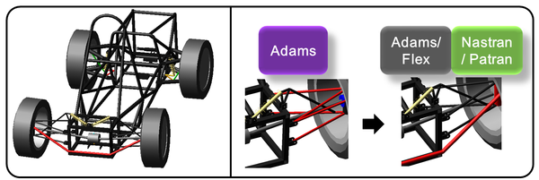
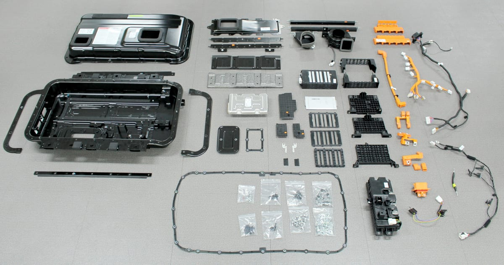
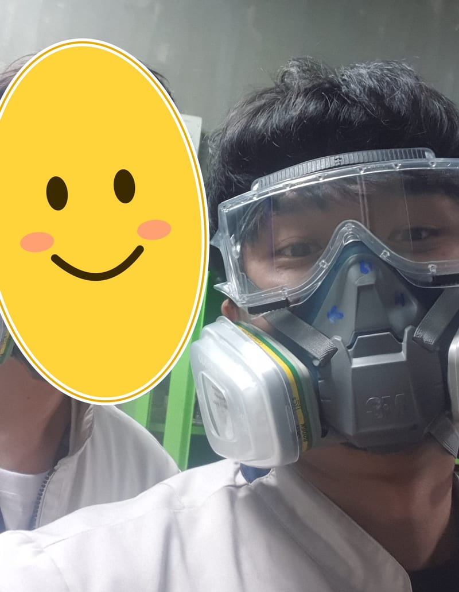
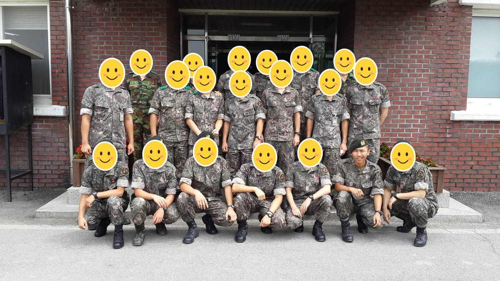
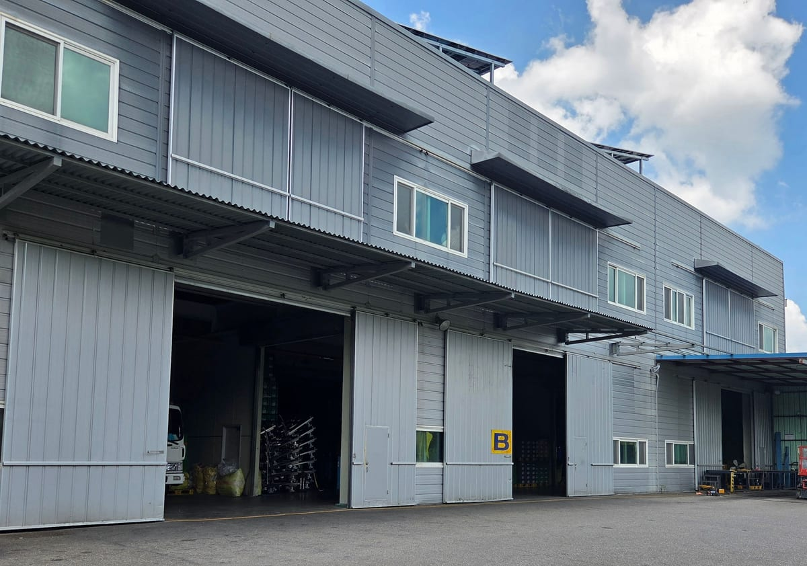
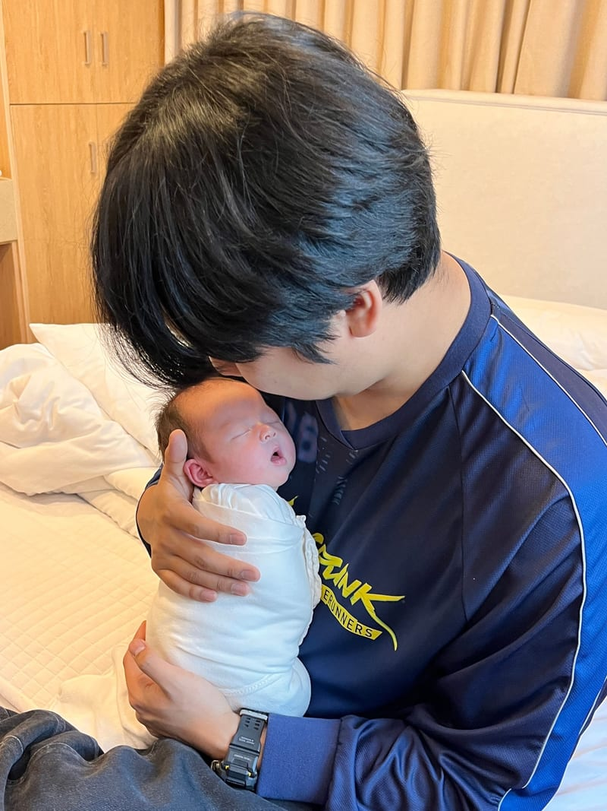

Hi, I'm Gumbo (Daehee Kim), a developer.

I mostly do web development, and recently I shipped a web-based app too. I take on whatever the service needs, frontend or backend.

## Experience

<ul class="experience">
<li>

<a href="https://www.unitblack.co.kr">Unitblack</a> · Fullstack Developer · 2026.01 – present

SAVE, a bookkeeping and tax service for small businesses

</li>
<li>

<a href="https://www.skelterlabs.com">Skelter Labs</a> · Fullstack Developer · 2023.08 – 2025.09

Bella, an LLM chatbot platform, and SI projects for Shinhan Securities and Samsung Electronics

</li>
<li>

<a href="https://wapl.ai">TmaxWAPL</a> · Fullstack Developer · 2022.03 – 2023.08

WAPL, a collaboration platform, and SuperApp

</li>
<li>

<a href="https://www.xingsoft.co.kr">Xingsoft</a> · Backend Developer · 2021.08 – 2022.03

CanB, an English education LMS, and English Egg

</li>
</ul>

## Before I became a developer

Somewhat unusually for a developer, I majored in mechanical engineering.

In university, I liked what I learned from books, but I had even more fun putting it to use. So I mostly studied analysis, solving mechanics equations on a computer, and used what I learned to build a car with the student car club.

I worked hard at it and won a few awards along the way.

- 2018.02 · Bronze Prize, University Simulation Contest (MSC Software)
- 2017.08 · Silver Prize in Design, Technical Division, KSAE Student Self-Made Car Competition
- 2016.08 · Gold Prize in Design, Technical Division, KSAE Student Self-Made Car Competition

Bronze Prize entry, 2018 MSC Simulation Contest Source: <a href="https://www.cadgraphics.co.kr/newsview.php?pages=lecture&sub=lecture04&catecode=6&num=6681">CAD&amp;Graphics</a>

Clay modeling the car exterior with the student car club

After graduating, I put my major to use and started my career at **HL Green Power**, working as a prototype development engineer for battery packs that go into Hyundai and Kia hybrid and electric vehicles. (2019 – 2020)

Components of a hybrid battery pack Source: <a href="https://designfolder.co.kr">Designfolder</a>

In the battery pack test building, about to clean up a pack after its evaluation

The longer I worked, the more I wanted a job where I could fix the problems right in front of me and see the results right away. So I left the company and switched careers to become a developer.

---

## TMI

### Why Gumbo

The nickname Gumbo comes from my time in the army. I spent a lot of my service working outdoors and got tanned dark, so people combined the Korean word for “black” (**geom**eun) with my post, “supply clerk” (**bo**geup), and called me “Geombo.” I liked it, so I still use it as my nickname.

Serving in the Army's 1101st Engineer Group

### A service I've run on my own since 2021

It doesn't have many users, but there's a service I've been running since 2021: a WMS (warehouse management system) used by the logistics company an acquaintance of mine runs.

It doesn't run on any cloud. It lives on-premise on a machine I built myself, part by part. I started with docker compose and now run it on k3s.

- **2021 · Eumseong plant** · Spring Boot + Thymeleaf\
  Inbound, outbound, and inventory management, plus client system integration (production plan lookup, automatic delivery cards)
- **2025 · Seosan plant** · NestJS + React\
  Mobile barcode scanning for inbound, outbound, and returns, a stock and statistics dashboard, and client system automation (collecting production plans and stock automatically)

Seosan plant

### Dad of a daughter

My lovely daughter was born in March 2026, and I became a dad.

