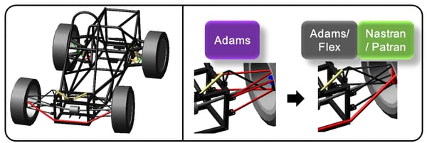
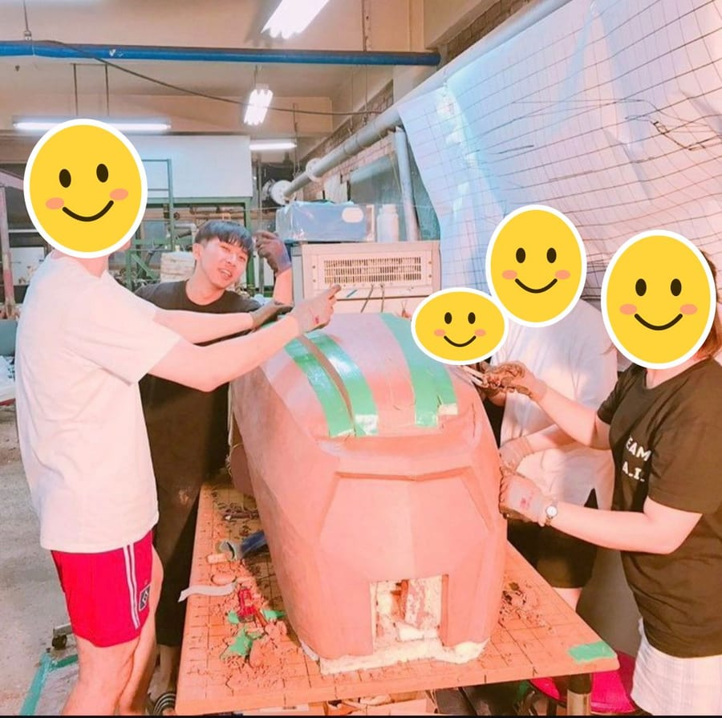

import unitblack from './assets/logos/unitblack.png';
import skelterlabs from './assets/logos/skelterlabs.png';
import tmaxwapl from './assets/logos/tmaxwapl.png';
import xingsoft from './assets/logos/xingsoft.png';

안녕하세요. 개발자 Gumbo(본명 김대희)입니다.

주로 웹 개발을 하고, 최근에는 웹 기반 앱도 출시해 봤습니다. 프론트엔드, 백엔드 가리지 않고 서비스에 필요한 일이면 이것저것 하고 있습니다.

## 경력

<ul class="experience">
<li>

<a href="https://www.unitblack.co.kr">유닛블랙</a> · Fullstack Developer · 2026.01 ~ 현재

소상공인 세무·장부 서비스 세이브(SAVE)

</li>
<li>

<a href="https://www.skelterlabs.com">스켈터랩스</a> · Fullstack Developer · 2023.08 ~ 2025.09

LLM 챗봇 플랫폼 Bella, 신한투자증권·삼성전자 SI 프로젝트

</li>
<li>

<a href="https://wapl.ai">티맥스 와플</a> · Fullstack Developer · 2022.03 ~ 2023.08

협업 플랫폼 WAPL, SuperApp

</li>
<li>

<a href="https://www.xingsoft.co.kr">씽소프트</a> · Backend Developer · 2021.08 ~ 2022.03

영어 교육 LMS CanB, English Egg

</li>
</ul>

## 연락처

- 이메일 · [dae4805@naver.com](mailto:dae4805@naver.com)
- 전화 · [010-9929-4805](tel:+821099294805)

## 개발자가 되기 전

개발자가 되기 전에는 특이하게도 기계공학을 전공했습니다.

대학 때는 책에서 배우는 지식도 좋았지만, 그걸 실제로 활용하는 데서 더 큰 재미를 느꼈습니다. 그래서 역학 공식을 컴퓨터로 풀어 보는 해석 공부를 주로 했고, 그렇게 배운 걸 바탕으로 자동차 동아리에서 직접 차를 만들어 보기도 했습니다.

나름 열심히 해서 아래와 같은 상들도 받아 봤습니다.

- 2018.02 · 대학(원)생 시뮬레이션 경진대회 동상 (MSC Software)
- 2017.08 · 대학생 자작 자동차 대회 기술부문 디자인 은상 (한국자동차공학회)
- 2016.08 · 대학생 자작 자동차 대회 기술부문 디자인 금상 (한국자동차공학회)

2018 MSC 시뮬레이션 경진대회 동상 수상작 출처: <a href="https://www.cadgraphics.co.kr/newsview.php?pages=lecture&sub=lecture04&catecode=6&num=6681">캐드앤그래픽스</a>

자작 자동차 동아리에서 차량 외장 클레이 작업

졸업하고는 전공을 살려 **HL그린파워**에서 첫 직장 생활을 했습니다. 현대·기아자동차의 하이브리드, 전기차에 들어가는 배터리팩 시작 개발 업무를 했습니다. (2019~2020)

하이브리드 배터리팩 구성품 출처: <a href="https://designfolder.co.kr">디자인폴더</a>

배터리팩 시험동에서 평가가 끝난 배터리팩을 청소하기 전

일을 할수록, 눈앞의 불편함을 직접 해결하고 그 결과를 바로 확인할 수 있는 일을 하고 싶어졌습니다. 그렇게 회사를 나와 개발자로 커리어 전환을 했습니다.

---

## TMI

### Gumbo라는 이름

Gumbo는 군대에서 생긴 별명입니다. 밖에서 작업하는 날이 많아서 늘 까맣게 타 있었는데, **검**은 얼굴에 보직인 **보**급계원을 붙여서 다들 검보라고 불렀습니다. 이름이 마음에 들어서 지금도 닉네임으로 쓰고 있습니다.

육군 1101 공병단 복무 중

### 2021년부터 개인 운영 중인 서비스

사용자는 많지 않지만, 2021년부터 운영하고 있는 서비스가 있습니다. 물류 회사를 운영하고 있는 지인의 회사에서 쓰는 WMS(창고 관리 시스템)입니다.

클라우드를 쓰지 않고, 부품을 하나하나 골라 직접 조립한 컴퓨터에 온프레미스로 올려서 운영하고 있습니다. 처음에는 docker compose로 띄웠고, 지금은 k3s로 돌리고 있습니다.

- **2021 · 음성 공장** · Spring Boot + Thymeleaf\
  입출고·재고 관리, 고객사 시스템 연동 (생산계획 조회, 납입카드 자동 발행)
- **2025 · 서산 공장** · NestJS + React\
  모바일 바코드 스캔 입출고·반품, 재고·통계 대시보드, 고객사 시스템 자동화 (생산계획·재고 자동 수집)

서산 공장

### 딸 아빠

2026년 3월에 사랑스러운 딸이 태어나서 아빠가 되었습니다.

