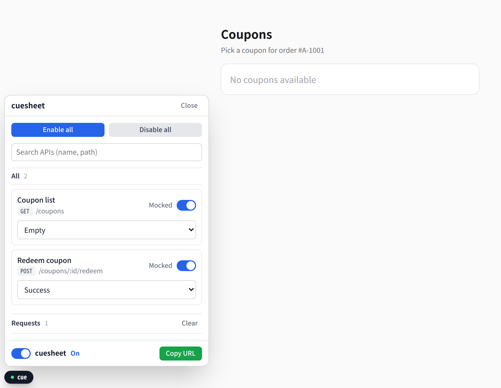

import devFlow from './assets/dev-flow.svg?url';
import structure from './assets/structure.svg?url';
import aiVerify from './assets/ai-verify.svg?url';
import qaBeforeAfter from './assets/qa-before-after.svg?url';
import situations from './assets/situations.svg?url';
import devFlowAfter from './assets/dev-flow-after.svg?url';

요즘 회사에서 새 제품을 개발하면서 프론트엔드 코드의 상당 부분을 AI로 짜고 있습니다. 요구사항을 정리해서 넘기면 화면 하나가 금방 나옵니다. 여러 기능을 동시에 맡겨 두고 다른 일을 하기도 합니다.

그런데 기능이 나가는 속도는 생각만큼 빨라지지 않았습니다. 코드는 빨리 나오는데, 그 코드가 맞는지 확인하는 일은 여전히 사람 몫이었기 때문입니다. 병목이 코드를 짜는 데서 확인하는 데로 옮겨 갔을 뿐이었습니다.

이 글은 그 확인을 AI에게 맡기려고 무엇을 바꿨는지, 그리고 그 덕분에 개발 속도와 커뮤니케이션 비용이 어떻게 달라졌는지에 대한 이야기입니다.

## 기능 하나가 나가기까지

기능 하나는 대략 이렇게 만들어집니다.


PM이 요구사항을 쓰면 개발자가 분석하고, 코드를 짜고, 검증해서 dev 서버에 올립니다. QA와 디자이너가 확인하고 나면 prod에 배포돼 유저에게 갑니다.

AI를 쓰면서 바뀐 건 가운데 "코드 작성" 칸입니다. AI가 구현하고, 테스트나 타입 검사로 스스로 확인하고, 틀리면 다시 고치는 루프를 혼자 돕니다. 이 칸은 확실히 빨라졌습니다.

그런데 그 뒤에 되돌아오는 곳이 두 군데 있습니다. 개발자가 검증할 때, 그리고 QA가 확인할 때입니다. 둘 다 이유가 같습니다. **확인하고 싶은 상황을 만들기가 어렵습니다.**

## 병목 1: 상황을 재현하기 어렵다

쿠폰 목록 화면을 예로 들어 보겠습니다. 요구사항은 이렇습니다.

- 쿠폰을 목록으로 보여준다.
- 10개를 넘으면 10개까지만 보여주고 더보기 버튼을 붙인다.
- 쿠폰이 하나도 없으면 빈 상태를 보여준다.
- 만료된 쿠폰은 "만료됨"으로 표시한다.

이 화면이 맞는지 확인하려면 같은 화면을 적어도 이 여섯 가지 상황에서 봐야 합니다.


그런데 이 상황들을 실제로 만들기가 어렵습니다.

**백엔드가 아직 없습니다.** 새 제품이라 백엔드도 같이 개발합니다. 응답 형식은 미리 합의하지만, 실제 API는 프론트보다 늦게 나오는 경우가 많습니다. 결국 화면을 다 만들어 놓고 API가 나온 뒤에야 제대로 붙여 볼 수 있고, 통합 테스트는 늘 막판에 몰립니다.

**백엔드가 있어도 상황을 만들기 어렵습니다.** 빈 상태를 보려면 내 계정의 쿠폰을 다 지워야 하고, 10개를 넘기려면 쿠폰을 잔뜩 발급해야 합니다. 공용 dev 서버라면 다른 사람의 작업을 깨뜨립니다. 에러나 느린 응답은 DevTools로 흉내 낼 수는 있지만, 매번 손으로 해야 하고 남에게 그대로 넘길 수도 없습니다.

**AI는 이 상황들을 보지 못합니다.** AI는 코드를 짜고 "완료했습니다"라고 말합니다. 타입도 맞고 테스트도 통과합니다. 하지만 쿠폰이 하나도 없을 때 화면이 정말 빈 상태를 보여주는지는 그 상황을 띄워 보기 전에는 모릅니다. 그 확인은 결국 제 몫이었습니다.

AI에게 여러 기능을 동시에 맡기면 확인할 것이 더 늘어납니다. 쿠폰 화면을 고치다가 옆의 포인트 화면이 깨지는 회귀가 생깁니다. 요구사항이 겹치는 자리에서 애매해지는 경우도 있습니다. 예를 들어 "만료된 쿠폰은 목록 맨 뒤로 보낸다"는 요구사항이 나중에 추가되면, 쿠폰이 12개인데 그중 3개가 만료됐을 때 만료된 쿠폰은 처음 10개 안에 들어가야 할까요, 더보기 뒤로 가야 할까요? 이런 건 그 상황을 실제로 띄워 봐야 눈에 들어오고, 그래야 PM에게 물어볼 수 있습니다.

디자인은 사정이 달랐습니다. Figma MCP를 붙이면 AI가 시안을 직접 읽고, 처음 뜨는 화면과 비교하면서 간격이나 색을 고칩니다. 화면 하나의 모양은 AI가 스스로 검증할 수 있는데, 여러 상황에서의 동작은 왜 안 될까 싶었습니다.

## 병목 2: 기능을 확인하기 어렵다

dev 서버에 올리고 나면 QA와 디자이너가 요구사항대로 동작하는지 확인합니다. 여기서도 같은 문제가 반복됩니다.

QA도 앞의 쿠폰 상황들을 똑같이 봐야 합니다. 그런데 dev 서버에는 지금 있는 데이터만 있습니다. QA가 "쿠폰이 하나도 없을 때를 확인하고 싶어요"라고 하면 누군가 그 상황을 만들어 줘야 하고, 보통 그 누군가는 개발자입니다. 디자이너가 "에러 화면이 시안대로 나오는지 보고 싶어요"라고 해도 마찬가지입니다.

결국 확인하기 쉬운 상황만 확인하고, 만들기 어려운 상황은 "개발자가 봤겠지" 하고 넘어가기 쉽습니다. 그렇게 넘어간 상황에서 버그가 나옵니다.

이상한 걸 찾아도 그 상황을 그대로 넘기기가 어렵습니다.

> 쿠폰 목록에서 만료 표시가 이상하게 나와요.

이 메시지를 받으면 질문부터 시작합니다. 어느 계정이었는지, 쿠폰이 몇 개였는지, 언제 봤는지. 그 사이 데이터가 바뀌었거나 시각이 지나서 다시 열어 보면 멀쩡한 경우도 많습니다. 재현이 안 되면 고칠 수도 없고, 고쳤는지 확인할 수도 없습니다. 그렇게 메시지가 몇 번 오가고 나서야 겨우 같은 화면을 보게 됩니다.

## MSW를 도입했지만, 클라이언트를 검증하는 방법은 그대로였다

백엔드를 기다리지 않고 프론트를 독립적으로 빠르게 개발하려고 MSW를 도입했습니다. MSW는 브라우저에서 나가는 요청을 가로채서 미리 정해 둔 응답을 돌려줍니다. 합의한 응답 형식대로 핸들러를 만들어 두면 API가 없어도 화면을 끝까지 개발할 수 있습니다.

```ts
http.get('/coupons', () => HttpResponse.json(coupons))
```

MSW는 4년 전에도 써 본 적이 있습니다. 그때는 AI가 없어서 핸들러와 목 데이터를 전부 손으로 써야 했고, 그 비용이 꽤 컸습니다. API가 늘어날 때마다 핸들러를 만들고, 응답 형식이 바뀌면 목 데이터도 같이 고쳐야 했습니다. 지금은 합의한 응답 형식을 AI에게 넘기면 핸들러가 바로 나옵니다. 작성하는 데 드는 시간은 거의 없어졌습니다.

백엔드를 기다리는 문제는 이걸로 풀렸습니다. 하지만 이 핸들러는 **한 번에 한 가지 응답만** 줍니다. 빈 상태를 보려면 `coupons`를 `[]`로 고치고, 에러를 보려면 500을 주도록 고칩니다. 다 보고 나면 원래대로 돌려놓아야 합니다.

**제가 쓰던 방식에서는 상황을 바꾸려면 핸들러 코드를 고치는 수밖에 없었고, 그게 두 병목의 공통 원인이었습니다.**

- **AI에게 맡기기 어렵습니다.** 검증하려고 핸들러를 고치고, 끝나면 되돌리는 과정이 또 하나의 작업이 됩니다. 되돌리는 걸 잊으면 그 자체로 버그가 됩니다. 지난주에 확인한 빈 상태가 지금도 괜찮은지 보려 해도 그때 했던 수정을 다시 해야 합니다.
- **사람끼리 공유하기 어렵습니다.** QA와 디자이너는 코드를 고칠 수 없습니다. 개발자도 "그 상황"을 말로 설명할 수밖에 없습니다.

## 상황에 이름을 붙였다

해결책은 단순합니다. 한 API에 응답을 여러 개 두고, 각각에 이름을 붙입니다. 이렇게 이름 붙인 응답을 시나리오라고 부르겠습니다.

```ts
export default {
  id: 'getCoupons',
  label: '쿠폰 목록',
  path: '/coupons',
  handler: [
    { scenario: 'OK', handler: http.get('/coupons', () => HttpResponse.json(coupons)) },
    { scenario: 'Empty', handler: http.get('/coupons', () => HttpResponse.json([])) },
    { scenario: 'Many', handler: http.get('/coupons', () => HttpResponse.json(manyCoupons)) },
    { scenario: 'Server error', handler: http.get('/coupons', () => new HttpResponse(null, { status: 500 })) },
  ],
}
```

이름이 생기면 링크가 됩니다. 앞에서 본 여섯 상황도 이렇게 주소 하나로 열립니다.

```text
/?cue=getCoupons:Empty                         쿠폰이 하나도 없는 화면
/?cue=getCoupons:Many                          쿠폰이 10개를 넘는 화면
/?cue=getCoupons:Server error,delay:1500       1.5초 뒤 에러가 나는 화면
/?cue=time:2026-03-01T00:00:00Z                쿠폰 만료일이 지난 시점의 화면
/?cue=offline                                  API 요청이 네트워크 오류로 실패하는 화면
```

코드를 고치지 않고 주소만 바꾸면 상황이 바뀝니다. 서버 응답뿐 아니라 응답 지연이나 오프라인 같은 네트워크 상태, 현재 시각도 같은 방식으로 고릅니다. 만료 표시를 보려고 쿠폰의 만료일이 지나기를 기다릴 필요가 없습니다.

시나리오마다 목 데이터를 따로 만드는 게 일 같지만, 이것도 부담이 없습니다. AI가 요구사항을 보고 핸들러와 함께 만들어 줍니다.

이 구조로 만든 라이브러리가 [cuesheet](https://github.com/GUMBOKIM/cuesheet)입니다.


- **API마다 파일 하나.** `getCoupons.mock.ts`처럼 API 하나에 파일 하나를 두고, 그 안에 시나리오별 MSW 핸들러를 배열로 넣습니다.
- **상태는 탭마다 하나, 바꾸는 방법은 쓰는 사람에 따라 다릅니다.** 어떤 API가 어떤 시나리오로 응답할지, 지연, 시각, 오프라인이 상태 하나에 모여 있고, 앱이 요청을 보낼 때마다 이 상태를 보고 응답을 고릅니다.
  - QA, 디자이너, PM 같은 비개발자는 화면 구석의 패널에서 클릭으로 고릅니다. 코드도 주소 문법도 몰라도 되고, 고른 상황은 패널의 Copy URL 버튼으로 링크로 복사합니다.
  - 개발자끼리는 확인할 상황을 `?cue=` 주소로 공유합니다. "빈 상태 확인해 주세요" 대신 `/?cue=getCoupons:Empty`를 보냅니다.
  - AI와 테스트도 같은 주소를 엽니다. 이미 열린 화면에서 상황을 바꿀 때는 `window.__cuesheet__`를 씁니다.



상태를 바꾸면 다음 요청부터 적용되므로, 패널에서 상황을 바꾸면 화면이 데이터를 다시 불러오도록 앱에 연결해 둡니다.

cuesheet는 dev 서버에서만 켜 두고, prod 빌드에서는 빠지게 해 뒀습니다. 고른 상황은 각자의 브라우저 탭 안에서만 적용되기 때문에, 공용 dev 서버라도 QA가 에러 상황을 열었다고 다른 사람의 화면이 바뀌지 않습니다. 실제 dev API로 보고 싶을 때는 패널에서 끄거나 `?cue=off`로 엽니다.

## AI가 화면까지 직접 확인하게 됐다

AI에게는 Playwright MCP와 Chrome DevTools MCP를 붙여 두었습니다. 둘 다 AI가 브라우저를 직접 열고, 화면을 읽고, 클릭할 수 있게 해 주는 도구입니다. Figma MCP가 AI에게 시안을 읽게 해 줬다면, 이 도구들과 링크는 AI에게 여러 상황에서의 동작을 읽게 해 줍니다. 링크 문법은 cuesheet 패키지에 들어 있는 에이전트용 안내서(`node_modules/cuesheet/AGENTS.md`)를 프로젝트의 에이전트 지침에서 가리켜 두면 AI가 알아서 씁니다.

이제 AI에게 기능을 맡길 때는 요구사항과 함께 확인할 상황을 같이 줍니다. 앞에서 애매했던 만료 쿠폰 정렬은 PM과 이야기해 "더보기 뒤로 보낸다"로 정했고, `Many` 시나리오에는 쿠폰 15개 중 3개가 이미 만료된 데이터가 들어 있다고 해 보겠습니다. 그러면 이런 식으로 맡깁니다.

```text
쿠폰 목록에 "만료된 쿠폰은 맨 뒤로 보낸다"를 추가해 줘. 만료된 쿠폰은 처음 10개에 넣지 말고 더보기 뒤로 보내.
끝나면 아래 링크를 열어서 확인하고, 기존 테스트도 돌려 줘.
- /?cue=getCoupons:Empty    빈 상태 문구가 나오는지
- /?cue=getCoupons:Many     처음 10개에 만료 쿠폰이 없는지, 더보기를 누르면 만료 쿠폰 3개가 맨 뒤에 나오는지
```

AI는 코드를 짠 뒤 링크를 차례로 열고, 화면을 읽고, 더보기를 눌러 가며 직접 확인합니다. 틀리면 스스로 고치고 다시 엽니다. 첫 그림의 "코드 작성" 칸 안에서 테스트와 타입 검사에 머물던 루프가, 이제 실제 화면까지 확인하는 루프가 된 셈입니다.


AI가 헤매지 않도록 몇 가지를 신경 썼습니다.

- **무엇을 바꿀 수 있는지 AI가 직접 물어볼 수 있습니다.** `window.__cuesheet__.getCatalog()`가 어떤 API에 어떤 시나리오가 있는지 돌려주므로, 앱 코드를 뒤지지 않아도 됩니다.
- **틀리면 고를 수 있는 이름을 같이 알려 줍니다.** 예를 들어 `Empty`를 `Emtpy`로 잘못 쓰면, 그 항목만 건너뛴 채 화면은 그대로 열리고 콘솔에 이런 경고가 남습니다. 화면만 보면 잘못 연 걸 모르고 지나갈 수 있지만, Chrome DevTools MCP로 콘솔을 읽으면 AI가 경고를 보고 이름을 고쳐 다시 엽니다.

  ```text
  [cuesheet] handler 'getCoupons' has no scenario 'Emtpy'. Available: OK, Empty, Many, Server error
  ```

- **같은 링크는 같은 조건으로 열립니다.** 시나리오와 지연, 시각, 오프라인이 링크에 다 들어 있고, 지연을 범위로 주지 않는 한 무작위가 없습니다. AI와 제가 같은 조건에서 화면을 봅니다.

확인이 끝나면 그 링크를 여는 테스트도 AI에게 남기게 합니다. 개발할 때 쓰던 핸들러를 테스트도 그대로 쓰기 때문에, 테스트용 목을 따로 관리할 필요가 없습니다.

```ts
await page.goto('/?cue=getCoupons:Empty')
await expect(page.getByText('쿠폰이 없습니다')).toBeVisible()

await page.goto('/?cue=getCoupons:Many')
await expect(page.getByRole('listitem')).toHaveCount(10)
await expect(page.getByRole('button', { name: '더보기' })).toBeVisible()
```

실제로 이 방식에서 가장 많이 잡히는 건 회귀입니다. 여러 기능을 동시에 맡기다 보면 한쪽을 고치면서 다른 화면이 깨지는데, AI가 기존 링크를 다시 열어 보고 테스트를 돌리다가 먼저 찾아냅니다.

제가 하는 일도 달라졌습니다. 전에는 화면을 하나하나 띄워서 찾고 확인했다면, 이제는 AI가 확인한 결과를 보고 필요한 화면만 열어 봅니다.

## 링크 하나로 이야기하게 됐다

링크는 사람끼리도 그대로 통합니다.

QA가 "쿠폰이 하나도 없으면 어떻게 보여요?"라고 물으면 이제 링크를 보냅니다. 상황을 만들어 줄 필요가 없습니다. 패널이 있으니 QA와 디자이너가 직접 이것저것 바꿔 보기도 합니다. 에러 화면, 느린 응답, 오프라인까지 개발자 없이 확인할 수 있습니다.


버그 제보도 바뀌었습니다. QA가 패널에서 Copy URL을 눌러 링크를 같이 보냅니다.

> 쿠폰 목록에서 만료 표시가 이상하게 나와요.
> `/?cue=getCoupons:Many,time:2026-03-01T00:00:00Z`

링크를 열면 제보한 시나리오와 시각 그대로 화면을 볼 수 있습니다. 쿠폰이 몇 개였는지, 언제였는지 물어볼 필요가 없습니다. 고친 뒤에는 같은 링크를 다시 보내서 확인을 부탁합니다.

디자이너와도 링크로 이야기합니다. 시안에는 빈 상태, 에러, 로딩처럼 평소에는 잘 보이지 않는 화면이 따로 그려져 있습니다. 전에는 이런 화면을 확인받으려면 스크린샷을 찍어 보내거나, 화면을 공유하면서 제가 상황을 하나씩 만들어 보여 줘야 했습니다. 이제는 시안의 화면마다 링크를 붙여 보냅니다.

```text
빈 상태     /?cue=getCoupons:Empty
에러        /?cue=getCoupons:Server error
로딩        /?cue=getCoupons:OK,delay:30000     (응답을 30초 늦춰 로딩 화면 확인)
```

디자이너는 링크를 열어 시안과 나란히 놓고 봅니다. 고칠 점이 있으면 그 링크와 함께 알려 줍니다. "이 화면에서 아이콘과 문구 사이가 좁아요"의 "이 화면"이 무엇인지 서로 헷갈릴 일이 없습니다. PM이 "이 경우엔 어떻게 보여야 하죠?"라고 물을 때도 마찬가지로, 말로 설명하는 대신 링크를 보내고 그 화면을 보면서 이야기합니다.

## 아직 남은 것

모든 게 풀린 건 아닙니다. 목은 목일 뿐입니다. 시나리오는 합의한 응답 형식을 보고 만든 것이라, 실제 서버가 다르게 응답하면 목에서 통과한 화면도 깨질 수 있습니다. 실제 API와의 통합 테스트는 여전히 필요합니다. 다만 시나리오별 화면 동작은 미리 확인해 두니, 통합할 때는 인증, 권한, 실제 응답 형식처럼 실제 API와 연결해야 드러나는 문제에 집중할 수 있습니다.

어떤 상황을 확인해야 하는지 빠짐없이 정하는 것도 여전히 사람 몫입니다. AI가 만든 시나리오 목록에 빠진 상황이 없는지는 제가 직접 봅니다.

## 마치며

AI 덕분에 코드를 짜는 속도는 빨라졌지만, 확인하는 방법은 그대로여서 병목이 확인 쪽으로 옮겨 갔습니다. 개발자는 상황을 재현하기 어려웠고 QA는 기능을 확인하기 어려웠는데, 그 이유는 상황을 바꾸는 방법이 코드 수정뿐이었기 때문입니다.

상황에 이름을 붙이고 링크로 고를 수 있게 만들자 두 가지가 달라졌습니다. AI가 코드를 건드리지 않고 화면을 직접 확인하게 되면서 개발이 빨라졌고, 사람들이 링크 하나로 같은 화면을 보게 되면서 주고받는 말이 줄었습니다. 처음 그림의 흐름은 이렇게 바뀌었습니다.


이 방식은 [cuesheet](https://github.com/GUMBOKIM/cuesheet)로 바로 써 볼 수 있습니다. 지금 쓰는 MSW 핸들러는 그대로 두고, 시작 코드만 바꾸면 됩니다. 써 보고 불편한 점이나 아이디어가 있으면 [이슈](https://github.com/GUMBOKIM/cuesheet/issues)로 남겨 주세요.
