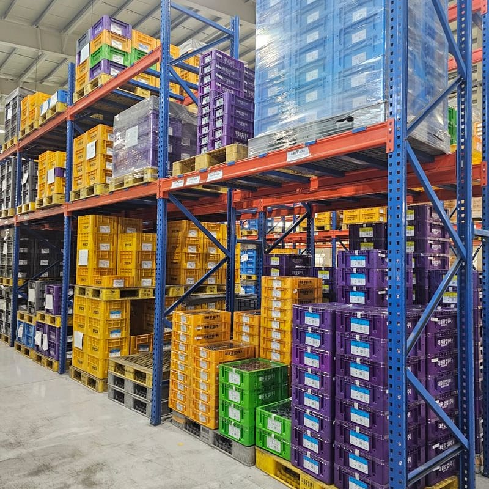
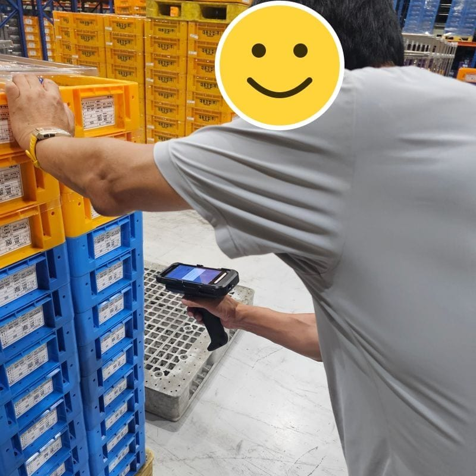

import network from './assets/network-en.svg?url';

Since 2021 I've been building and running the WMS (warehouse management system) used at the factories of a logistics company run by someone I know. No cloud: it has been running on a single PC I put together myself for five years now.

- **2021 · Eumseong plant**: Inbound/outbound and inventory management, integration with the client's system
- **2025 · Seosan plant**: Mobile barcode scanning for inbound/outbound, inventory and stats dashboards, scraping and automation for client systems
- **Server**: One PC. Started with a Ryzen 7 5700G / 32GB, now a Ryzen 7 7700 / 64GB

<div class="gallery">
<div>


<p class="caption">Inside the logistics warehouse</p>

</div>
<div>


<p class="caption">A barcode scanning demo</p>

</div>
</div>

I started it because I wanted to try technologies like JPA that I couldn't use at my job back then. I also wanted to fix the hassles my acquaintance was dealing with.

## Why not the cloud

There were two reasons.

The first was **learning**. I figured I'd learn a lot by building the server myself, setting up the network, and running it all the way through.

The second was **cost**. Nobody knew yet whether the system would actually get used, so paying a server bill every month from day one was a burden for my acquaintance too. At the early scale, an AWS EC2 `t3.medium` (2 vCPUs, 4GB of memory, about $38 a month in the Seoul region) would probably have been enough, but that's still money going out every month.

A PC, once bought, costs nothing month to month. Building it came to around 600,000 won back then, and its electricity was lost in the factory's power bill. Even against a `t3.medium`, the PC pays for itself in a little over a year, and there's no comparison on performance. The 5700G has 8 cores and 16 threads, so just matching thread count and memory on EC2 puts you at roughly a `c5.4xlarge` (16 vCPUs, 32GB of memory), which is about $560 a month.

In the end it was a trade: a bit more hassle for me, in exchange for a well-specced server at a low cost.

## How I ran it

At first the PC sat in a corner of the Eumseong plant's office. In 2025, when I built the system for the Seosan plant, I moved the PC to Seosan too, and the Eumseong plant now uses it over the web.

Running a server on a single PC without the cloud is simpler than you might think. A request from outside reaches the server in this order.


You set it up by walking this path backwards, from the server on the inside out to the domain on the outside.

1. **Give the server PC a fixed IP**: Turn off automatic IP assignment (DHCP) on the server PC and set its internal IP by hand. That way the server's address doesn't change when the router hands out IPs again.
2. **Port forwarding on the router**: This passes requests from outside on to the server PC. At first I opened only ports 80 and 443 for the web and 22 for SSH.
3. **Point the domain**: I bought the domain from Namecheap and pointed an A record at the public IP the ISP had assigned. HTTPS certificates came from Let's Encrypt.

The ISP's public IP wasn't a static IP plan, but it barely changed as long as the modem stayed connected. Still, to be ready for when it did change, I later turned on the router's DDNS feature and pointed the Namecheap domain at that DDNS address. Routers like ipTIME and ASUS support DDNS out of the box, so it isn't hard to set up.

At first, remote access was nothing more than SSHing into the factory's public IP from outside and logging in with a username and password.

Then one day I noticed traces of someone trying to log in over SSH. Of course people will come knocking if you leave port 22 open to the internet, but at the time it hadn't crossed my mind.

The first thing I did was add Google Authenticator to the SSH login, so getting in took an OTP on top of the password. Later I dropped the SSH port forward entirely: now I connect to the internal network through the router's built-in OpenVPN first, then SSH in from there. The only ports forwarded to the server PC now are 80 and 443 for the web, plus one VPN port open on the router itself.

These days deployment means building a Docker image and pushing it to the server.

## The scariest day

Early on, the way I started the services was simple too. Back then it was a Spring Boot app and MariaDB, and I'd written an sh script that launched those processes and set it to run automatically at boot.

Then the factory lost power. Once the power came back I asked someone on site to press the server's power button, but something got tangled in the startup order and the app didn't come up.

The site called to say "the system isn't working." They got through that day by recording everything in Excel, and as soon as I left work I drove to the Eumseong plant myself and brought the server back up.

After that I threw out the sh script and moved to docker compose. I put MariaDB and the Spring Boot app in one config file and set a `restart` policy on each container. That way, once Docker comes up after a boot, the containers come back on their own, and if the app starts before the DB and fails, the restart policy brings it back up. I used this setup until I moved to k3s while building the Seosan plant system in 2025.

## Things I learned to take care of

### Monitoring

For me, monitoring came down to two things: logs and resources.

**Logs**

The time I really felt why logs matter was a problem with PDF files.

At first I developed on Windows while the server ran Linux. Then the production server started throwing errors while saving and reading back certain PDFs. No matter what I did, I couldn't reproduce it on my own PC.

Only after checking the logs did I find the cause. I was building paths by gluing strings together with a backslash, like `"upload\\" + fileName`. On Windows that's a folder separator, but on Linux `\` is just a character in the file name. So on Linux, instead of going inside the `upload` folder, a file literally named `upload\a.pdf` was being created somewhere else entirely.

I replaced the string concatenation with `Paths.get(...).resolve(...)` and moved the storage folder into a config file, so the dev PC and the server each use their own value.

```java
@Value("${file.upload-dir}") // dev PC: C:/wms/upload, server: /data/wms/upload
private String uploadDir;

Path file = Paths.get(uploadDir).resolve(fileName); // Java picks the right separator
```

These days I collect the logs with Filebeat.

**Resources**

After moving to k3s, pods started dying once or twice a day.

I'd written the scraping and automation code to drive a browser directly, running Playwright in headless mode. Launching browsers eats a lot of memory, but with plenty of RAM I figured it would be fine.

I didn't know why for a long time, and only found out later by looking at resource usage in Grafana. During busy hours, browsers Playwright had launched were staying alive after their jobs finished, and they piled up until memory was full.

Back then I launched the browser with `launchPersistentContext`. It lets you keep browser data like login state in a folder and pick it up again, but every call starts a whole new Chromium process. If you don't call `close()`, the process stays behind after the job ends, and it's especially easy to leave one behind when an error in the middle of a job skips the code that closes it.

I changed it so the browser is closed in `finally`, whether the job succeeds or fails.

```ts
const context = await chromium.launchPersistentContext(userDataDir, { headless: true });
try {
  // log in, scrape, issue delivery slips ...
} finally {
  await context.close(); // cleans up the browser process even if something throws
}
```

After that fix, the PC I'd specced so generously sits at only about 20% usage on a normal day. I still watch CPU and memory usage in Grafana.

### Alerts

I get alerts on Discord.

Where I need them most is the scraping and automation. When a client updates their site, the page structure changes and the logic breaks; when an account password changes, it fails right at login. Without an alert I'd have no way of knowing until I ran it myself. And if it keeps trying to log in with a wrong password, the account can get locked.

Since moving to k3s, server-side problems like a pod dying also send an alert to Discord. I no longer find out only when the site calls, the way I did during the power outage.

### Data backups

Luckily I haven't lost any data yet. But five years of inbound, outbound, and inventory data have piled up, and losing it now would be a serious problem for running the company. I dump the DB regularly to a NAS-grade HDD connected separately to the server.

### Isolating external services

Scraping production plans and inventory from client systems, and the automation that posts shipments to client sites and issues delivery slips, are things we don't control. When a client changes an address, updates their system, or has a server outage, these are hit directly.

Tie this tightly to our own system and you're in big trouble. Our WMS shouldn't stop just because a client's system did. For example, even if posting to the client's site fails during a shipment, the shipment itself still completes in the WMS. Only the failed ones need to be uploaded to the client's site by hand. Whatever goes wrong on the client's side, inbound and outbound work on the floor doesn't stop.

### Things can die

When people say the server died, they usually picture the server PC. But there were actually three devices that could stop: the ISP modem, the router, and the server PC. And even if all three are fine, none of it matters when the power goes out. So I decided, one by one, what to do when each of them stops.

- **Power**: I added a UPS. I bought it secondhand on Karrot and hooked up the modem, router, and server PC to it. By my rough math it lasts about 10 minutes, which has been enough to ride out the factory power briefly going out and coming back.
- **Server PC**: I set the BIOS to power on automatically when power comes back. No more asking someone on site to press the power button. There's also a spare computer ready to take over if the PC dies outright.
- **Router**: I bought a second unit of the exact same model. If it breaks, I can move the settings over and swap it right in.
- **Modem**: It's the ISP's equipment, so there's no backup plan for it. That one's still on my to-do list.

## What I liked about running it

Being responsible for everything from start to finish was hard. From development itself to putting the server together, the network, deployments, and handling outages, there was no one to hand anything off to. But that was also what made it genuinely fun.

## Wrapping up

I plan to keep trying out all sorts of things on this server. That said, someday I plan to move all of it to the cloud.

One last thing: unless learning is really the point, just pay for the cloud. It's a real hassle.


<p class="caption">Five years of running it, summed up</p>
